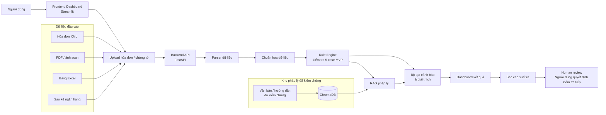

# GD1-04 — Sơ đồ kiến trúc kỹ thuật TaxGPT

## 1. Mục tiêu kiến trúc

Kiến trúc TaxGPT được thiết kế cho phạm vi MVP nhằm chứng minh tính khả thi của một luồng rà soát sớm rủi ro thuế từ hóa đơn, chứng từ và dữ liệu kế toán cơ bản. Thiết kế ưu tiên dễ trình diễn, dễ mở rộng và dễ kiểm soát rủi ro khi sử dụng AI.

Rule engine dự kiến xử lý các điều kiện kiểm tra rõ ràng của năm case MVP. RAG dự kiến được dùng để truy xuất nội dung từ kho pháp lý đã được kiểm chứng, còn AI chỉ hỗ trợ diễn giải cảnh báo bằng ngôn ngữ dễ hiểu. Kết quả cuối cùng luôn cần con người xem xét; hệ thống không tự đưa ra quyết định pháp lý.

**Trạng thái hiện tại:** dự án đã có khung FastAPI, giao diện Streamlit tối thiểu, thư mục lưu trữ ChromaDB và dữ liệu mẫu giả lập. Các module upload hoàn chỉnh, parser, chuẩn hóa, rule engine, RAG, giải thích AI và xuất báo cáo vẫn là **kiến trúc dự kiến cho MVP**, chưa được mô tả như tính năng đã hoàn thành.

## 2. Sơ đồ tổng quan hệ thống

Sơ đồ thể hiện hai nguồn chính: dữ liệu nghiệp vụ do người dùng cung cấp và kho pháp lý đã được kiểm chứng. Rule engine tạo kết quả kiểm tra kỹ thuật; RAG bổ sung ngữ cảnh tham khảo; lớp giải thích tổng hợp hai đầu vào trước khi hiển thị cho người dùng.

## 3. Mô tả từng thành phần

| Thành phần | Vai trò | Công nghệ dự kiến | Ghi chú MVP |
|---|---|---|---|
| **Frontend Dashboard** | Cung cấp giao diện tải dữ liệu, chọn kỳ rà soát, xem cảnh báo và lý do. | Streamlit | Đã có giao diện tối thiểu; màn hình upload và kết quả chi tiết vẫn dự kiến bổ sung. |
| **Backend API** | Tiếp nhận yêu cầu từ giao diện và điều phối các bước xử lý. | FastAPI | Đã có khung ứng dụng và endpoint kiểm tra trạng thái; API nghiệp vụ chưa hoàn thiện. |
| **File Upload** | Nhận hóa đơn, chứng từ và sao kê trong phạm vi định dạng được hỗ trợ. | Thành phần upload của Streamlit kết hợp FastAPI | Dự kiến giới hạn loại tệp, kích thước và kiểm tra lỗi đầu vào. |
| **Parser** | Đọc tệp và trích xuất các trường như số hóa đơn, MST, ngày, tiền hàng, VAT và thông tin thanh toán. | Python; thư viện đọc XML, PDF và Excel phù hợp | Chưa triển khai hoàn chỉnh; cần đánh giá riêng độ chính xác đối với PDF hoặc ảnh scan. |
| **Data Normalizer** | Đưa dữ liệu từ nhiều nguồn về một cấu trúc thống nhất để so sánh. | Python và mô hình dữ liệu nội bộ | Dự kiến chuẩn hóa ngày, chuỗi, tiền tệ và trường còn thiếu. |
| **Rule Engine** | Kiểm tra năm case MVP bằng điều kiện rõ ràng và lưu lý do kích hoạt cảnh báo. | Python, các rule có thể kiểm thử độc lập | Chưa triển khai; cần cấu hình hồ sơ người mua tham chiếu, sai số kỹ thuật và tham số nghiệp vụ. |
| **RAG / ChromaDB** | Tìm nội dung liên quan từ kho tài liệu pháp lý đã kiểm chứng để bổ sung ngữ cảnh. | ChromaDB, embedding và pipeline RAG | Đã chuẩn bị thư mục lưu trữ; kho tài liệu và pipeline truy xuất vẫn cần xây dựng, kiểm chứng. |
| **AI Explanation Layer** | Chuyển kết quả kỹ thuật và nội dung truy xuất thành giải thích dễ hiểu, kèm giới hạn. | Mô hình ngôn ngữ kết hợp prompt kiểm soát | Chỉ diễn giải và hỗ trợ hỏi đáp; không tự thay đổi kết quả rule hoặc kết luận pháp lý. |
| **Report Generator** | Tổng hợp cảnh báo, dữ liệu liên quan, lý do và gợi ý kiểm tra thành báo cáo. | Python; định dạng xuất dự kiến như Excel hoặc PDF | Chưa triển khai; MVP ưu tiên báo cáo ngắn, có thể truy ngược về dữ liệu nguồn. |
| **Human Review** | Kiểm tra dữ liệu gốc, ngoại lệ nghiệp vụ và căn cứ liên quan trước khi quyết định. | Quy trình nghiệp vụ của người dùng | Là bước bắt buộc; không được tự động hóa thành phán quyết pháp lý. |

## 4. Luồng xử lý dữ liệu

1. **Người dùng upload dữ liệu:** Hóa đơn XML, PDF, Excel hoặc sao kê ngân hàng được đưa vào hệ thống trong phạm vi định dạng MVP hỗ trợ.
2. **Hệ thống đọc và trích xuất:** Parser lấy các trường cần thiết; tệp lỗi hoặc trường không đọc được phải được đánh dấu để người dùng biết.
3. **Dữ liệu được chuẩn hóa:** Ngày, MST, tên đơn vị, giá trị tiền và thông tin thanh toán được đưa về cấu trúc chung.
4. **Rule engine kiểm tra năm case MVP:** Hệ thống thực hiện các phép so sánh và tính toán có điều kiện rõ ràng, sau đó ghi nhận dữ liệu nào đã kích hoạt cảnh báo.
5. **RAG truy xuất nội dung liên quan:** Chỉ nội dung từ kho pháp lý đã được kiểm chứng mới được dùng làm căn cứ giải thích; kết quả truy xuất vẫn là thông tin tham khảo.
6. **AI diễn giải cảnh báo:** AI trình bày dấu hiệu phát hiện, lý do và gợi ý bước rà soát tiếp theo bằng ngôn ngữ dễ hiểu, không tự nâng cảnh báo thành kết luận pháp lý.
7. **Người dùng xem kết quả:** Dashboard và báo cáo hỗ trợ người dùng đối chiếu hồ sơ gốc, thực hiện human review và quyết định bước xử lý tiếp theo.

## 5. Vai trò của Rule Engine và AI

| Lớp | Trách nhiệm chính | Không được làm |
|---|---|---|
| **Rule Engine** | Kiểm tra điều kiện rõ ràng như dấu hiệu trùng hóa đơn, MST không khớp hồ sơ tham chiếu, VAT lệch phép tính, ngày hóa đơn ngoài kỳ dữ liệu và thiếu liên kết chứng từ thanh toán. | Không diễn giải hậu quả pháp lý hoặc tự đặt thêm rule nghiệp vụ chưa được xác nhận. |
| **RAG** | Truy xuất đoạn nội dung liên quan từ kho tài liệu đã được kiểm chứng và giữ thông tin nguồn để đối chiếu. | Không dùng tài liệu chưa kiểm chứng làm căn cứ chắc chắn; không tự quyết định hóa đơn đúng hay sai. |
| **AI Explanation Layer** | Giải thích cảnh báo, tóm tắt dữ liệu liên quan và hỗ trợ người dùng đặt câu hỏi. | Không thay đổi kết quả kiểm tra kỹ thuật, không khẳng định chắc chắn về pháp lý. |
| **Con người** | Kiểm tra chứng từ gốc, xem xét ngoại lệ, đối chiếu quy định và đưa ra quyết định cuối cùng. | Không nên coi cảnh báo tự động là kết luận thay cho đánh giá chuyên môn. |

Việc tách rule engine khỏi lớp AI giúp các điều kiện kiểm tra có thể nhìn thấy, kiểm thử và truy ngược. RAG giới hạn phần giải thích vào kho tài liệu đã chuẩn bị, qua đó giảm nguy cơ AI tạo nội dung không có căn cứ. Tuy nhiên, các biện pháp này chỉ giảm rủi ro ảo giác; chúng không biến cảnh báo kỹ thuật thành kết luận pháp lý.

## 6. Kiến trúc MVP và khả năng mở rộng

MVP chỉ xử lý năm case đã chọn và sử dụng dữ liệu mẫu đơn giản để chứng minh luồng hoạt động. Thiết kế theo module cho phép nhóm mở rộng từng phần sau khi có kết quả kiểm thử:

- Bổ sung các case rủi ro mới sau khi rule nghiệp vụ được con người xác nhận.
- Hỗ trợ thêm định dạng và biến thể hóa đơn, chứng từ hoặc sao kê.
- Nâng cấp kho RAG bằng tài liệu được kiểm chứng, gắn metadata nguồn, hiệu lực và phạm vi áp dụng.
- Cải thiện parser và OCR cho tài liệu scan, đồng thời đo lường độ chính xác trích xuất.
- Bổ sung xác thực người dùng, phân quyền truy cập và bảo vệ dữ liệu.
- Lưu lịch sử kiểm tra, phiên bản rule và dấu vết giải thích để phục vụ rà soát nội bộ.

Các khả năng trên là hướng phát triển, chưa phải tính năng đã hoàn thành trong MVP hiện tại.

## 7. Rủi ro kỹ thuật và biện pháp kiểm soát

| Rủi ro kỹ thuật | Ảnh hưởng | Biện pháp kiểm soát |
|---|---|---|
| **File đầu vào sai định dạng hoặc bị hỏng** | Parser không đọc được hoặc tạo dữ liệu thiếu. | Kiểm tra loại tệp, kích thước và cấu trúc; từ chối tệp không hỗ trợ; hiển thị lỗi rõ ràng. |
| **Dữ liệu upload bị truy cập hoặc lưu giữ ngoài phạm vi cần thiết** | Có thể làm lộ thông tin hóa đơn, giao dịch hoặc dữ liệu doanh nghiệp. | Chỉ dùng dữ liệu giả lập khi demo; khi phát triển với dữ liệu thật phải có xác thực, phân quyền, mã hóa, giới hạn thời gian lưu và cơ chế xóa dữ liệu. |
| **OCR/PDF trích xuất sai** | MST, ngày hoặc số tiền có thể bị nhận diện nhầm và tạo cảnh báo sai. | Hiển thị trường đã trích xuất để người dùng đối chiếu; đánh dấu độ tin cậy thấp; ưu tiên XML/Excel khi có. |
| **Rule engine phát hiện nhầm** | Tạo cảnh báo thừa hoặc bỏ sót tình huống cần rà soát. | Viết test cho từng rule, dùng dữ liệu bình thường và dữ liệu rủi ro, lưu lý do kích hoạt, cho phép con người phản hồi kết quả. |
| **Kho pháp lý chưa được kiểm chứng đầy đủ** | Phần giải thích có thể thiếu, lỗi thời hoặc không phù hợp bối cảnh. | Chỉ đưa tài liệu đã được con người kiểm tra vào kho dùng cho giải thích; gắn nguồn và trạng thái kiểm chứng; tiếp tục GD1-P1 song song. |
| **AI giải thích quá chắc chắn** | Người dùng có thể hiểu cảnh báo như một phán quyết. | Dùng prompt giới hạn, mẫu câu an toàn, trích nguồn, hiển thị cảnh báo về phạm vi và chặn các kết luận tuyệt đối. |
| **Người dùng hiểu nhầm cảnh báo là kết luận pháp lý** | Có thể dẫn đến quyết định nghiệp vụ không phù hợp. | Gắn nhãn “cần rà soát”, nêu rõ giới hạn trên Dashboard/báo cáo và bắt buộc human review trước khi xử lý. |

## 8. Kết luận

Kiến trúc TaxGPT phù hợp để phát triển một MVP có phạm vi rõ ràng và có thể trình diễn bằng dữ liệu mẫu. Sự kết hợp giữa rule engine, RAG và human review giúp cân bằng giữa tự động hóa, khả năng giải thích và kiểm soát rủi ro AI. Sau khi các module được triển khai, kiểm thử và phần pháp lý được tiếp tục kiểm chứng, kiến trúc này có thể làm nền tảng phát triển prototype cho Vòng 2.
